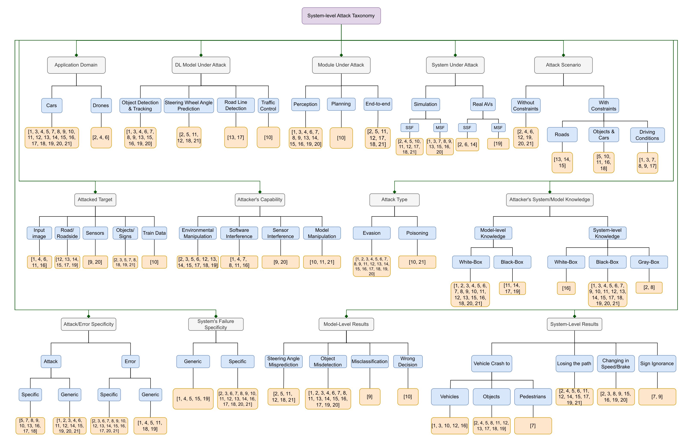

# System-level attack taxonomy for Deep Learning in Autonomous Vehicles

> This repository contains a taxonomy-style index of system-level attacks on DL components in Autonomous Vehicles (papers published 2017-01-01 → 2024-01-01). The taxonomy and mappings below are derived from the paper: A Taxonomy of System-Level Attacks on Deep Learning Models in Autonomous Vehicles, used to build this repo.

---

## Quick start

- **What this repo is:** a lightweight, curated taxonomy and index (titles + links) of the papers for system-level attacks on DL in AVs. Unlike a bibliography, this README prioritizes *taxonomy-based discovery* (categories, leaves, and links to papers) so researchers can quickly find papers by attack properties.
- **Where the content comes from:** the taxonomy and mappings were extracted from the paper (Tehrani et al., *A Taxonomy of System-Level Attacks on Deep Learning Models in Autonomous Vehicles*). See the original paper for full details and full references. 

- **Files included in this document:**
  - `data/papers_full.csv` (full taxonomy mapping — exact headers preserved from the paper's Appendix Tables 3–5)
  - `data/summary_full.json` (machine-friendly JSON summary mirroring the full CSV)
  - `taxonomy.md` is a readable Markdown version of the full taxonomy mapping.
  - `categories.md` is a full description of the meanings of each category.
---

## Scope & inclusion criteria (short)

- **Time window:** studies published between **2017-01-01** and **2024-01-01**.
- **What we include:** papers that *execute an attack on DL components in an AV context and report a system-level failure or observable system-level effect* (e.g., crash, lane-departure, freeze, wrong decision). This intentionally excludes papers that only report model-level mispredictions without any system-level evaluation.

- **What we exclude (and why):**
  - Sensor *physical removal/physical tampering* papers that only remove sensors or physically damage hardware without targeting DL model inputs are outside our focus when they do not produce DL-based model mispredictions leading to system-level failures. 
  - Network-only attacks (purely communication-layer exploits) were excluded because the taxonomy focuses on attacks that manipulate the *DL components or their inputs/outputs* and track how those model-level changes propagate to system-level failures. 

---

## What is a "system-level attack"?

A **system-level attack** is an adversarial action that (1) causes a DL component in an autonomous vehicle to produce a model-level error (e.g., misdetection, wrong steering-angle prediction, misclassification) and (2) — crucially — that model-level error **propagates** into a measurable failure at the vehicle/system level (e.g., lane departure, collision, emergency braking, freezing).

This emphasizes the *end-to-end chain* from environment/digital manipulation → **model misprediction** → **system-level consequence**. The taxonomy classifies attacks based on where and how the chain is built (attacked target, attacker capability, model under attack, application, system-level result, etc.).

---

## Categories

Please refer to `categories.md` for a full explanation of the meaning of each category.

---

## Taxonomy Mapping

Please refer to `taxonomy.md` for a full taxonomy mapping.

---

## Papers

Below we list the 21 papers included in the taxonomy. These papers are sorted by publication year.

1. <a id="ref-1"></a>SlowTrack: Increasing the latency of camera-based perception in autonomous driving using adversarial examples (Ma et al., 2024)<a href="https://ojs.aaai.org/index.php/AAAI/article/view/28200">Paper</a>
2. <a id="ref-2"></a>RPAU: Fooling the eyes of UAVs via physical adversarial patches (Liu et al., 2024)<a href="https://ieeexplore.ieee.org/stamp/stamp.jsp?tp=&arnumber=10265297">Paper</a>
3. <a id="ref-3"></a>Adversarial attacks on adaptive cruise control systems (Guo et al., 2023)<a href="https://www.scopus.com/inward/record.uri?partnerID=HzOxMe3b&scp=85159779784&origin=inward">Paper</a>
4. <a id="ref-4"></a>Learning when to use adaptive adversarial image perturbations against autonomous vehicles (Yoon et al., 2023)<a href="https://ieeexplore.ieee.org/stamp/stamp.jsp?tp=&arnumber=10138012">Paper</a>
5. <a id="ref-5"></a>DeepManeuver: Adversarial test generation for trajectory manipulation of autonomous vehicles (von Stein et al., 2023)<a href="https://ieeexplore.ieee.org/stamp/stamp.jsp?tp=&arnumber=10213222">Paper</a>
6. <a id="ref-6"></a>Kidnapping deep learning-based multirotors using optimized flying adversarial patches (Hanfeld et al., 2023)<a href="https://ieeexplore.ieee.org/abstract/document/10416782">Paper</a>
7. <a id="ref-7"></a>Does physical adversarial example really matter to autonomous driving? (Wang et al., 2023)<a href="https://openaccess.thecvf.com/content/ICCV2023/html/Wang_Does_Physical_Adversarial_Example_Really_Matter_to_Autonomous_Driving_Towards_ICCV_2023_paper.html">Paper</a>
8. <a id="ref-8"></a>On data fabrication in collaborative vehicular perception: Attacks and countermeasures (Zhang et al., 2023)<a href="https://www.usenix.org/system/files/sec23winter-prepub-37-zhang-qingzhao.pdf">Paper</a>
9. <a id="ref-9"></a>Rolling colors: Adversarial laser exploits against traffic light recognition (Yan et al., 2022)<a href="https://www.usenix.org/conference/usenixsecurity22/presentation/yan">Paper</a>
10. <a id="ref-10"></a>Stop-and-go: Exploring backdoor attacks on deep reinforcement learning-based traffic congestion control systems (Wang et al., 2021)<a href="https://ieeexplore.ieee.org/stamp/stamp.jsp?tp=&arnumber=9541185">Paper</a>
11. <a id="ref-11"></a>Attack and fault injection in self-driving agents on the CARLA simulator – experience report (Piazzesi et al., 2021)<a href="https://dl.acm.org/doi/10.1007/978-3-030-83903-1_14">Paper</a>
12. <a id="ref-12"></a>Dirty road can attack: Security of deep learning based automated lane centering under Physical-World attack (Sato et al., 2021)<a href="https://www.usenix.org/conference/usenixsecurity21/presentation/sato">Paper</a>
13. <a id="ref-13"></a>Invisible for both camera and LiDAR: Security of multi-sensor fusion based perception in autonomous driving (Cao et al., 2021)<a href="https://ieeexplore.ieee.org/stamp/stamp.jsp?tp=&arnumber=9519442">Paper</a>
14. <a id="ref-14"></a>Too good to be safe: Tricking lane detection in autonomous driving with crafted perturbations (Jing et al., 2021)<a href="https://www.usenix.org/system/files/sec21-jing.pdf">Paper</a>
15. <a id="ref-15"></a>Robust roadside physical adversarial attack against deep learning in LiDAR perception modules (Yang et al., 2021)<a href="https://dl.acm.org/doi/pdf/10.1145/3433210.3453106">Paper</a>
16. <a id="ref-16"></a>ML-driven malware that targets AV safety (Jha et al., 2020)<a href="https://arxiv.org/pdf/2004.13004.pdf">Paper</a>
17. <a id="ref-17"></a>Attacking vision-based perception in end-to-end autonomous driving models (Boloor et al., 2020)<a href="https://www.sciencedirect.com/science/article/pii/S1383762120300606">Paper</a>
18. <a id="ref-18"></a>Feasibility and suppression of adversarial patch attacks on end-to-end vehicle control (Pavlitskaya et al., 2020)<a href="https://ieeexplore.ieee.org/stamp/stamp.jsp?tp=&arnumber=9294426">Paper</a>
19. <a id="ref-19"></a>Phantom of the ADAS: split-second phantom attacks (Nassi et al., 2020)<a href="https://dl.acm.org/doi/pdf/10.1145/3372297.3423359">Paper</a>
20. <a id="ref-20"></a>Adversarial sensor attack on LiDAR-based perception (Cao et al., 2019)<a href="https://dl.acm.org/doi/pdf/10.1145/3319535.3339815">Paper</a>
21. <a id="ref-21"></a>Trojaning attack on neural networks (Liu et al., 2017)<a href="https://scholarship.libraries.rutgers.edu/esploro/outputs/991031794682704646/filesAndLinks?institution=01RUT_INST&skipUsageReporting=true&recordUsage=false&index=0">Paper</a>

---
## Full taxonomy tree (image)



---

## Full taxonomy tree (textual)

Below is the **full taxonomy tree (textual)** that mirrors the paper's taxonomy (12 top-level categories and subcategories). Each leaf lists the reference numbers of the papers from the original paper; those reference numbers map to the **Papers** section above.

```
System-level attack taxonomy
├─ Application Domain
│  ├─ Cars -> [1,3,4,5,7,8,9,10,11,12,13,14,15,16,17,18,19,20,21]
│  └─ Drones -> [2,4,6]
│
├─ DL Model Under Attack
│  ├─ Object Detection & Tracking -> [1,3,4,6,7,8,9,13,14,15,16,19,20]
│  ├─ Steering Wheel Angle Prediction -> [5,17,21]
│  ├─ Road Line Detection / Lane Detection -> [12,14,18]
│  └─ End-to-end (E2E) / Driving Agents -> [2,5,11,12,17,18,21]
│
├─ System Under Attack
│  ├─ Simulation (SSF / MSF / other simulators) -> [2,4,5,10,11,12,17,18,21]
│  ├─ Real AVs (Tesla, etc.) -> [1,3,7,8,9,13,15,16,20]
│  └─ Multi-Sensor Fusion (MSF) vs Single-Sensor Fusion (SSF) distinctions -> MSF papers: [1,3,7,8,13,15,16,20]; SSF papers: [2,4,5,6,11,12,17,18,21]
│
├─ Attack Scenario
│  ├─ Following / Vehicle-to-vehicle scenarios -> [3,5]
│  ├─ Intersection scenarios -> [1,12]
│  ├─ Waypoint / Destination tracking (drones) -> [2,6]
│  └─ Generic driving scenarios (simulation experiments) -> [4,7,8,9,10,11,13,14,15,16,17,18,19,20,21]
│
├─ Attacked Target
│  ├─ Input image -> [1,4,6,11,16]
│  ├─ Road / Roadside (paint, billboards, projections) -> [12,13,14,15,17,18,19]
│  ├─ Sensors (camera/LiDAR/laser interference) -> [9,20]
│  └─ Training data / Backdoor (Trojan) -> [10,21]
│
├─ Attacker's Capability (examples)
│  ├─ Attach stickers / patches / projections -> [3,5,6,12,14,15,18,19]
│  ├─ Install malware / manipulate training -> [4,10,21]
│  └─ Laser / sensor spoofing -> [9,20]
│
├─ Attack Strategy (Attack Type)
│  ├─ Evasion -> [1,2,3,4,5,6,7,8,9,11,12,13,14,15,16,17,18,19,20]
│  └─ Poisoning (Backdoor/Trojan) -> [10,21]
│
├─ Attacker's System/Model Knowledge
│  ├─ White-box (WM) -> many papers list WM or mixed knowledge (see CSV for per-paper detail)
│  ├─ Black-box (BS) -> [11,14,17,19]
│  └─ Gray-box (GS) -> [2,8,...] (see CSV for exact labels)
│
├─ Attack/Error Specificity
│  ├─ Generic Attack / Generic Error (AG / EG) -> [1,4,5,15,19]
│  └─ Specific Attack / Specific Error (AS / ES) -> [2,3,6,7,8,9,10,11,12,13,14,16,17,18,20,21]
│
├─ Failure Specificity
│  ├─ Generic (aims to cause any failure) -> [1,4,5,15,19]
│  └─ Specific (aims at a targeted system-level failure) -> [2,3,6,7,8,9,10,11,12,13,14,16,17,18,20,21]
│
├─ Model-level Results
│  ├─ Misdetection / Missing detection -> [1,3,4,6,7,8,9,13,14,15,16,19,20]
│  └─ Misclassification / Wrong steering angle / Increased latency -> [2,5,10,11,12,17,18,21]
│
└─ System-level Results (Failure Propagation)
   ├─ Vehicle crash / collision -> [1,3,10,12,16]
   ├─ Losing the path / Lane departure -> [5,11,12,18,21]
   ├─ Freeze / Sudden braking / Emergency brake -> [2,4,5,6,11,12,14,15,17,19,20,21]
   └─ Sign ignorance / Wrong decision -> [9,10,19]
```

---

## Contributing

If you want to **add a paper** or **adjust a mapping**: please open a PR and add a row to `data/papers_full.csv` and update `data/summary_full.json`. Use the same fields and the `Ref` number should map to the number used in the original paper (or, if adding a new paper, add a new `Ref` number and include the source link).

> Thank you for contributing. This repository is a living taxonomy compiled from Tehrani et al.'s paper. Please add papers that match these criteria: (1) the attack demonstrates a DL-model-level misprediction and (2) the authors report a system-level effect or vehicle-level consequence. When possible, provide a stable link (DOI / arXiv / project page) and list which taxonomy categories apply. We will review PRs and merge after basic sanity checks.

---

## Citation 
If you find this taxonomy useful, please consider giving it a star &#127775;, and cite the published paper:
[https://arxiv.org/abs/2503.09385](https://arxiv.org/abs/2412.04510)
```bibtex
@article{tehrani2024taxonomy,
  title={A Taxonomy of System-Level Attacks on Deep Learning Models in Autonomous Vehicles},
  author={Tehrani, Masoud Jamshidiyan and Kim, Jinhan and Foulefack, Rosmael Zidane Lekeufack and Marchetto, Alessandro and Tonella, Paolo},
  journal={arXiv preprint arXiv:2412.04510},
  year={2024}
}
```

## How to replicate the paper:
1. Install <a href="https://github.com/jonatasgrosman/findpapers">findpapers</a> by using ``pip install findpapers``.
2. Find our query from the **send_query.py**. Copy it and run it to find and extract the papers.
3. Change the ``json_dir_path = './findpapers'`` in the **venue_filter.py** to the direction of your outputed list of papers.
4. Run the **venue_filter.py** to filter venues based on the listed venues in **chosen_venues.txt** file.
5. You will have a **papers_after_venue_filter.csv** which contains the title, abstract, URLs, venue, and published date of the papers.

- Note: The **venue_freq.py** file outputs the number of papers extracted from each venue, separated by journals and conferences. You can skip running this code, as it was only intended for us to find related venues.
